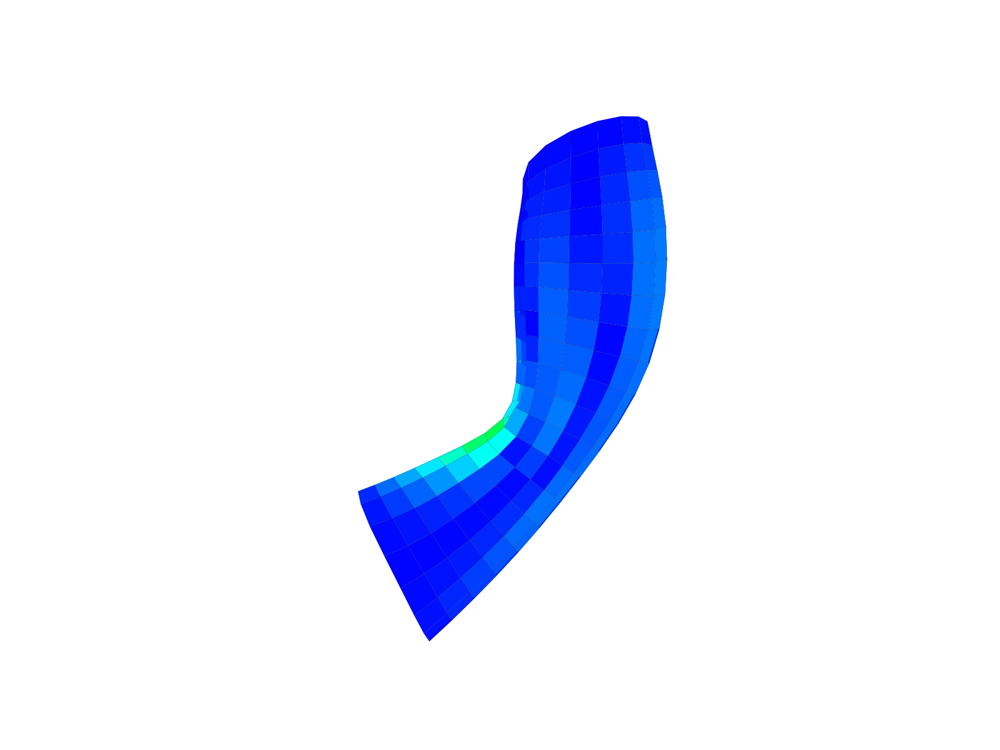

# compas_libigl

Opinionated COMPAS compatible bindings for top-level algorithms of libigl.

## Goals

* Create bindings that can be used in Blender (CPython) and in Rhino (IronPython).
* Provide solutions based on cmake, pybind, Rhino SDK.

## Challenges

**Blender**

Bindings have to be generated for specific versions of Python, corresponding to
the embedded Python of different Blender releases. For example, Blender 2.78 expects
Python version 3.5.2.

**Rhino**

Bindings have to be generated using the Rhino SDK such that .NET compatible code
can be exposed through RhinoCommon.

## Related projects

* [PyMesh](https://github.com/PyMesh/PyMesh)
* [rhino3dm.py](https://github.com/mcneel/rhino3dm/blob/master/RHINO3DM.PY.md)
* [PyTriangle](https://github.com/pletzer/pytriangle)
* [Triangle](https://github.com/drufat/triangle)

## References

* [PyBind: building with cmake](https://pybind11.readthedocs.io/en/stable/compiling.html#building-with-cmake)
* [PyBind: building manually](https://pybind11.readthedocs.io/en/stable/compiling.html#building-manually)

## Examples

Some (CPython) bindings are easy to generate with the manual PyBind instructions.
For example, the function `igl::planarize_quad_mesh` can be made available following
the below procedure.

### Requirements

* Anaconda(3)
* COMPAS
* libigl
* Eigen
* PyBind11

### Files

**planarize.cpp**

```cpp
#include <igl/planarize_quad_mesh.h>
#include <pybind11/pybind11.h>
#include <pybind11/eigen.h>

using RowMatrixXd = Eigen::Matrix<double, Eigen::Dynamic, Eigen::Dynamic, Eigen::RowMajor>;
using RowMatrixXi = Eigen::Matrix<int, Eigen::Dynamic, Eigen::Dynamic, Eigen::RowMajor>;


RowMatrixXd planarize(RowMatrixXd V, RowMatrixXi F)
{
    RowMatrixXd Vplanar;

    igl::planarize_quad_mesh(V, F, 100, 0.005, Vplanar);

    return Vplanar;
}


using namespace pybind11::literals;

PYBIND11_MODULE(planarize, m) {
    m.def("planarize", &planarize, "V"_a.noconvert(), "F"_a.noconvert());
}
```

**planarize.py**

```python
import numpy
import compas

from compas.datastructures import Mesh
from compas.datastructures import mesh_flatness
from compas.plotters import MeshPlotter
from compas.utilities import i_to_rgb

import planarize

mesh1 = Mesh.from_json(compas.get('tubemesh.json'))

vertices, faces = mesh1.to_vertices_and_faces()

V1 = numpy.array(vertices, dtype=numpy.float64)
F1 = numpy.array(faces, dtype=numpy.int32)
V2 = planarize.planarize(V1, F1)

mesh2 = Mesh.from_vertices_and_faces(V2, faces)

dev2 = mesh_flatness(mesh2, maxdev=0.02)

plotter = MeshPlotter(mesh2)
plotter.draw_faces(facecolor={fkey: i_to_rgb(dev2[fkey]) for fkey in mesh2.faces()})
plotter.show()
```

### Steps

1.  Add a reference to `libigl`, `Eigen` and `pybind11` to your `.bash_profile`

    ```bash
    export CPLUS_INCLUDE_PATH="path/to/libigl/include:$CPLUS_INCLUDE_PATH"
    export CPLUS_INCLUDE_PATH="path/to/eigen:$CPLUS_INCLUDE_PATH"
    export CPLUS_INCLUDE_PATH="path/to/pybind11/include:$CPLUS_INCLUDE_PATH"
    ```

2.  Compile `planarize.cpp`

    ```bash
    $ c++ -O3 -Wall -shared -std=c++11 -undefined dynamic_lookup planarize.cpp -o planarize.so
    ```

3.  Run `planarize.py`

### Result

The result should look somewhat like this


