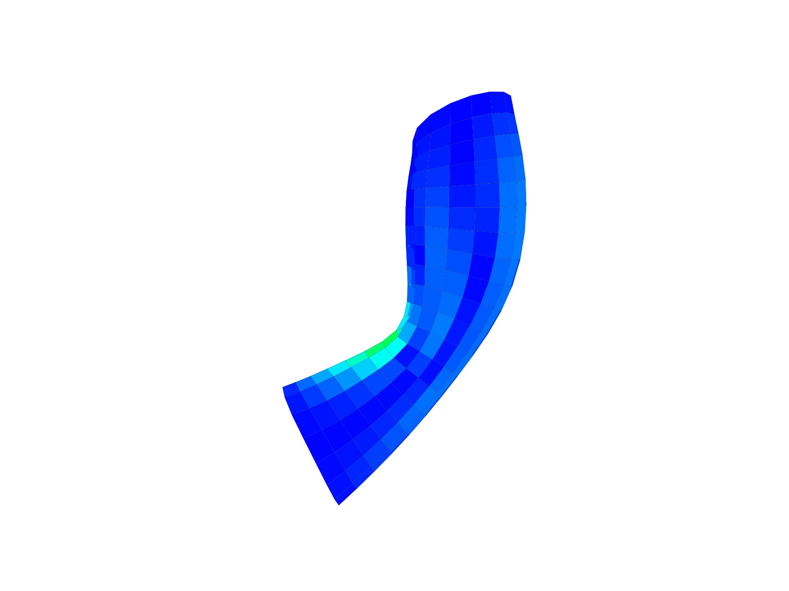
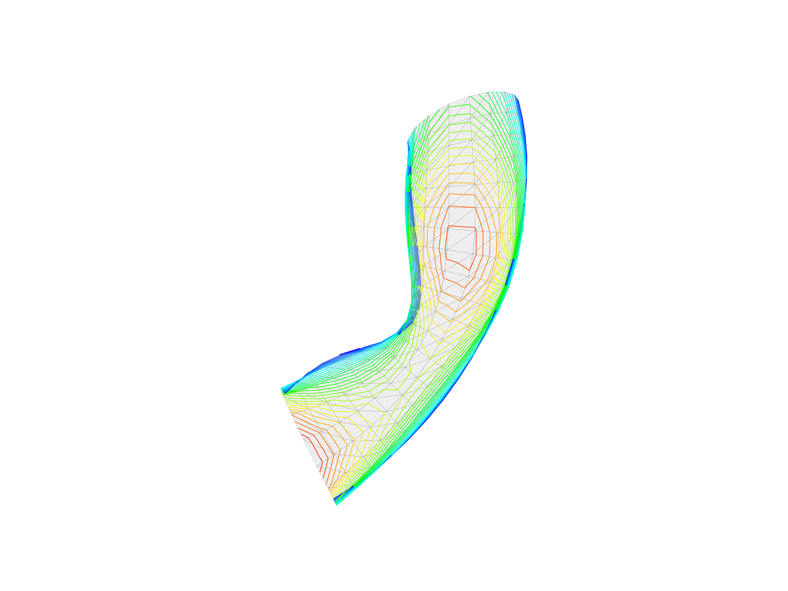
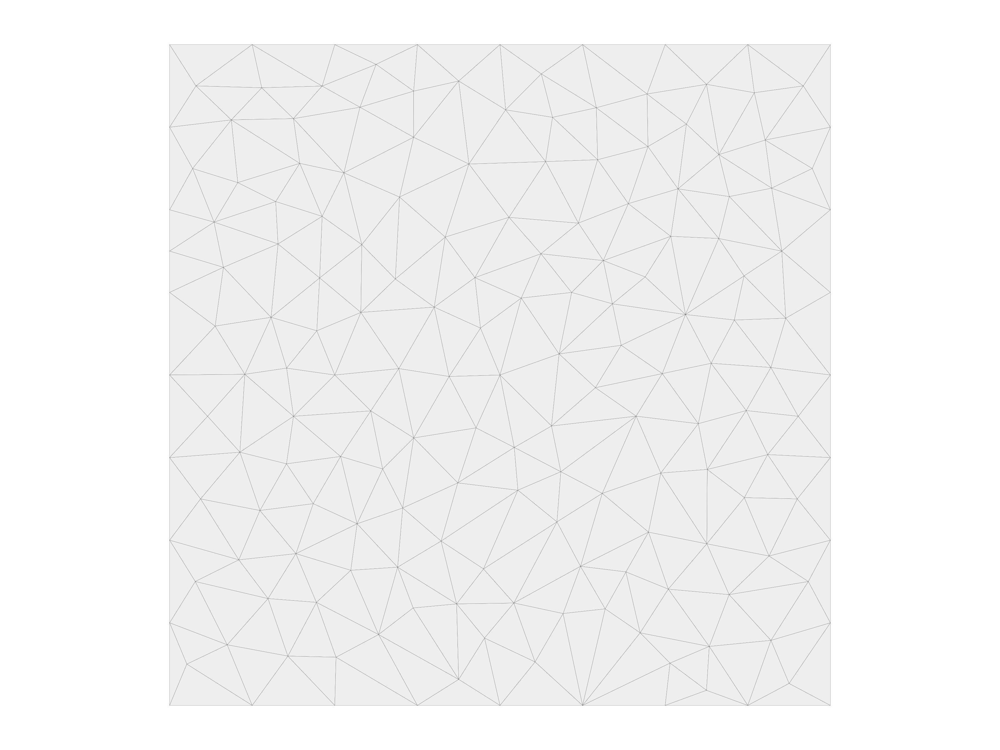

# compas_libigl

Opinionated COMPAS compatible bindings for top-level algorithms of libigl.

## Goals

* Create bindings that can be used in Blender (CPython) and in Rhino (IronPython).
* Provide solutions based on cmake, pybind, Rhino SDK.

## Challenges

* Callbacks
* Live updating
* Dynamic visualisation

**Blender**

Bindings have to be generated for specific versions of Python, corresponding to
the embedded Python of different Blender releases. For example, Blender 2.78 expects
Python version 3.5.2.

**Rhino**

Bindings have to be generated using the Rhino SDK such that .NET compatible code
can be exposed through RhinoCommon.

## Related projects

* [PyMesh](https://github.com/PyMesh/PyMesh)
* [rhino3dm.py](https://github.com/mcneel/rhino3dm/blob/master/RHINO3DM.PY.md)
* [PyTriangle](https://github.com/pletzer/pytriangle)
* [Triangle](https://github.com/drufat/triangle)
* [CMake Triangle](https://github.com/wo80/Triangle)
* [Projects in C](https://userpages.umbc.edu/~rostamia/cbook/triangle.html)
* [cppimport](https://github.com/tbenthompson/cppimport)

### PyBind

* [PyBind: building with cmake](https://pybind11.readthedocs.io/en/stable/compiling.html#building-with-cmake)
* [PyBind: building manually](https://pybind11.readthedocs.io/en/stable/compiling.html#building-manually)
* <https://github.com/pybind/pybind11/issues/134>
* <https://github.com/pybind/pybind11/issues/1200>
* <https://pybind11.readthedocs.io/en/stable/advanced/cast/stl.html>

### SO

* <https://stackoverflow.com/questions/16439654/how-can-i-compile-triangle-using-makefiles-on-a-windows-machine>
* <https://stackoverflow.com/questions/1099981/why-cant-python-find-shared-objects-that-are-in-directories-in-sys-path>

## Installation

### Library

**Prerequisite Library**

* Anaconda(3)
* COMPAS

**Git Submodule Library**

* libigl
* PyBind11

Anaconda 3 can be obtained from the official website. With `conda` installing COMPAS is as simple as `$ conda install COMPAS`. (Make sure your compas version is 0.4.10, which you can get by typing `python -c “import compas; print(compas.__version__)` in terminal)

### Compile

Before using cmake to compile the file, make sure followings are correct

* cmake version >= 3.12
* confirm your anaconda python location by typing `which python` in terminal
* change the `PYTHON_EXECUTABLE` as well as `PYBIND11_PYTHON_VERSION` in `compas_libigl/CMakeLists.txt` if it does not match your system settings.

In terminal

* `mkdir build`
* `cd build`
* `cmake -DCMAKE_BUILD_TYPE=Release ..`
* `make -j 4`

### Run

To find the compiled library, please go to `compas_libigl/lib`. Taking `igl::triangulation` as an example, to run it just type `python lib/triangualtion/triangulation.py` in terminal. The program should run correctly without throwing error.

## Example Gallery

### Example 1: `igl::planarize_quad_mesh`

**planarize.cpp**

```cpp
#include <igl/planarize_quad_mesh.h>
#include <pybind11/pybind11.h>
#include <pybind11/eigen.h>

using RowMatrixXd = Eigen::Matrix<double, Eigen::Dynamic, Eigen::Dynamic, Eigen::RowMajor>;
using RowMatrixXi = Eigen::Matrix<int, Eigen::Dynamic, Eigen::Dynamic, Eigen::RowMajor>;


RowMatrixXd planarize(RowMatrixXd V, RowMatrixXi F)
{
    RowMatrixXd Vplanar;

    igl::planarize_quad_mesh(V, F, 100, 0.005, Vplanar);

    return Vplanar;
}


using namespace pybind11::literals;

PYBIND11_MODULE(planarize, m) {
    m.def("planarize", &planarize, "V"_a.noconvert(), "F"_a.noconvert());
}
```

**planarize.py**

```python
import numpy
import compas

from compas.datastructures import Mesh
from compas.datastructures import mesh_flatness
from compas_plotters import MeshPlotter
from compas.utilities import i_to_rgb

import planarize

mesh1 = Mesh.from_json(compas.get('tubemesh.json'))

vertices, faces = mesh1.to_vertices_and_faces()

V1 = numpy.array(vertices, dtype=numpy.float64)
F1 = numpy.array(faces, dtype=numpy.int32)
V2 = planarize.planarize(V1, F1)

mesh2 = Mesh.from_vertices_and_faces(V2, faces)

dev2 = mesh_flatness(mesh2, maxdev=0.02)

plotter = MeshPlotter(mesh2)
plotter.draw_faces(facecolor={fkey: i_to_rgb(dev2[fkey]) for fkey in mesh2.faces()})
plotter.show()
```



### Example 2: `igl::isolines`

**iso.cpp**

```cpp
#include <pybind11/pybind11.h>
#include <pybind11/eigen.h>

#include <igl/isolines.h>

namespace py = pybind11;

using RowMatrixXd = Eigen::Matrix<double, Eigen::Dynamic, Eigen::Dynamic, Eigen::RowMajor>;
using RowMatrixXi = Eigen::Matrix<int, Eigen::Dynamic, Eigen::Dynamic, Eigen::RowMajor>;

struct Result {
    RowMatrixXd vertices;
    RowMatrixXi edges;
};


Result isolines(RowMatrixXd V, RowMatrixXi F, Eigen::VectorXd z, int n)
{
    RowMatrixXd Vi;
    RowMatrixXi Ei;

    igl::isolines(V, F, z, n, Vi, Ei);

    Result result;

    result.vertices = Vi;
    result.edges = Ei;

    return result;
}


using namespace pybind11::literals;

PYBIND11_MODULE(iso, m) {
    m.def("isolines", &isolines, "V"_a.noconvert(), "F"_a.noconvert(), "z"_a, "n"_a);

    py::class_<Result>(m, "Result")
        .def_readonly("vertices", &Result::vertices)
        .def_readonly("edges", &Result::edges);
}
```

**iso.py**

```python
from itertools import groupby

import numpy

import compas

from compas.datastructures import Mesh
from compas.datastructures import mesh_quads_to_triangles
from compas_plotters import MeshPlotter
from compas.utilities import i_to_rgb

import iso

mesh = Mesh.from_json(compas.get('tubemesh.json'))
mesh_quads_to_triangles(mesh)

key_index = mesh.key_index()

v = mesh.get_vertices_attributes('xyz')
f = [[key_index[key] for key in mesh.face_vertices(fkey)] for fkey in mesh.faces()]
z = mesh.get_vertices_attribute('z')

V = numpy.array(v, dtype=numpy.float64)
F = numpy.array(f, dtype=numpy.int32)
Z = numpy.array(z, dtype=numpy.float64)
N = 30

result = iso.isolines(V, F, Z, N)

zmin = min(z)
zmax = max(z)
zspn = zmax - zmin

edges = groupby(result.edges, key=lambda e: result.vertices[e[0]][2])

lines = []
for z, group in edges:
    color = i_to_rgb((z - zmin) / zspn)
    for i, j in group:
        lines.append({
            'start' : result.vertices[i],
            'end'   : result.vertices[j],
            'color' : color
        })

plotter = MeshPlotter(mesh)
plotter.draw_faces()
plotter.draw_lines(lines)
plotter.show()
```



### Example 3: `igl::triangulation`

**triangulation.cpp**

```cpp
// requires triangle.h
// g++ -O3 -Wall -shared -std=c++11 -fPIC -undefined dynamic_lookup -I/opt/triangle triangulation.cpp -o triangulation.so
// triangle library also needs to be compiled
// tried: cc -O -I/opt/local/include -L/opt/local/lib -shared -o triangle.so triangle.c -lm
// but doesn't change anything

#include <pybind11/pybind11.h>
#include <pybind11/eigen.h>
#include <iostream>
#include <igl/triangle/triangulate.h>


using RowMatrixXd = Eigen::Matrix<double, Eigen::Dynamic, Eigen::Dynamic, Eigen::RowMajor>;
using RowMatrixXi = Eigen::Matrix<int, Eigen::Dynamic, Eigen::Dynamic, Eigen::RowMajor>;

namespace py = pybind11;


struct Result {
    RowMatrixXd vertices;
    RowMatrixXi faces;
};


Result polygon(RowMatrixXd V, RowMatrixXi E)
{
    RowMatrixXd H;

    RowMatrixXd V2;
    RowMatrixXi F2;

    igl::triangle::triangulate(V, E, H, "a0.005q", V2, F2);

    Result result;

    RowMatrixXd V2_3D = RowMatrixXd::Zero(V2.rows(), V2.cols() + 1);
    V2_3D.leftCols(V2.cols()) = V2;

    result.vertices = V2_3D;
    result.faces = F2;

    return result;
}


PYBIND11_MODULE(triangulation, m) {
    m.def("polygon", &polygon, py::arg("V").noconvert(), py::arg("E").noconvert());

    py::class_<Result>(m, "Result")
        .def_readonly("vertices", &Result::vertices)
        .def_readonly("faces", &Result::faces);
}
```

**triangulation.py**

```python
import numpy

import compas
import triangulation as tri

from compas.datastructures import Mesh
from compas_plotters import MeshPlotter

V = numpy.array([[0, 0], [1, 0], [1, 1], [0, 1]], dtype=numpy.float64)
E = numpy.array([[0, 1], [1, 2], [2, 3], [3, 0]], dtype=numpy.int32)

result = tri.polygon(V, E)

V2 = result.vertices
F2 = result.faces

mesh = Mesh.from_vertices_and_faces(V2.tolist(), F2.tolist())

plotter = MeshPlotter(mesh)

plotter.draw_faces()

plotter.show()
```

