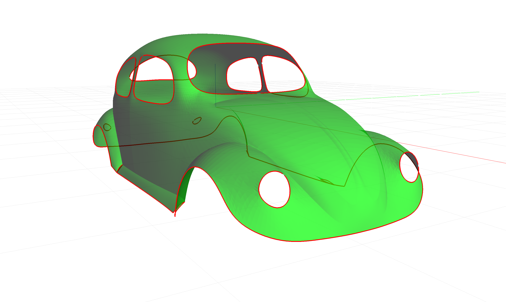
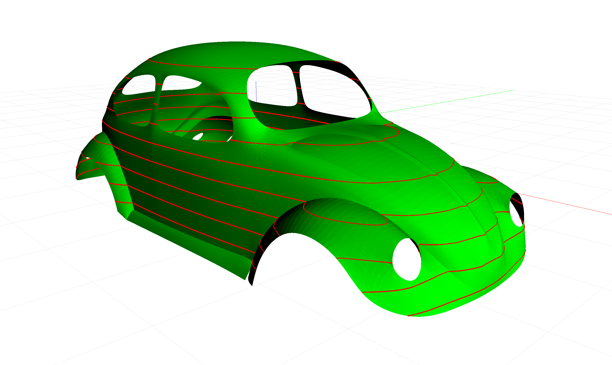
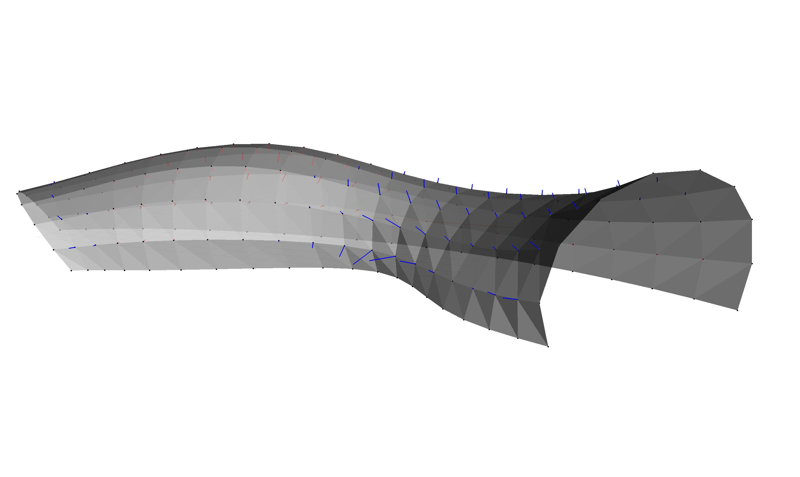

********************************************************************************
Examples
********************************************************************************

The examples shown here reproduce some of the examples of the original C++ *libigl* tutorial.
The python files for the examples are in the
`examples folder of the compas_libigl repo <https://github.com/BlockResearchGroup/compas_libigl/tree/master/examples>`_.
The sample files for the examples can be downloaded from the
`libigl tutorial data repo <https://github.com/libigl/libigl-tutorial-data>`_

Boundary loops
==============

    Boundary loops of :download:`beetle.off <https://raw.githubusercontent.com/libigl/libigl-tutorial-data/master/beetle.off>`,
    generated with :download:`examples/boundaries.py <../examples/boundaries.py>`

Isolines
========

    Contours of :download:`beetle.off <https://raw.githubusercontent.com/libigl/libigl-tutorial-data/master/beetle.off>`,
    generated with :download:`examples/isolines.py <../examples/isolines.py>`

Ray/mesh intersection
=====================

.. figure:: ../examples/intersections.png
    :figclass: figure
    :class: figure-img img-fluid

    Ray intersections with :download:`tubemesh.off <https://raw.githubusercontent.com/blockresearchgroup/compas_libigl/master/tubemesh.off>`,
    generated with :download:`examples/intersections.py <../examples/intersections.py>`

Curvature
=========

    Gaussian curvature of :download:`tubemesh.off <https://raw.githubusercontent.com/blockresearchgroup/compas_libigl/master/tubemesh.off>`,
    generated with :download:`examples/curvature.py <../examples/curvature.py>`

Geodesic distance
=================

